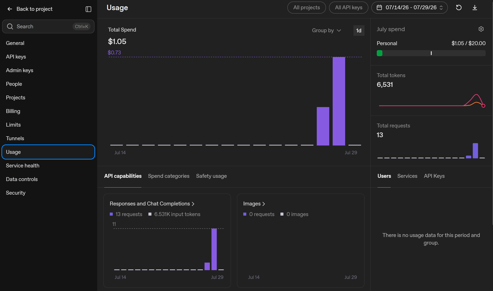
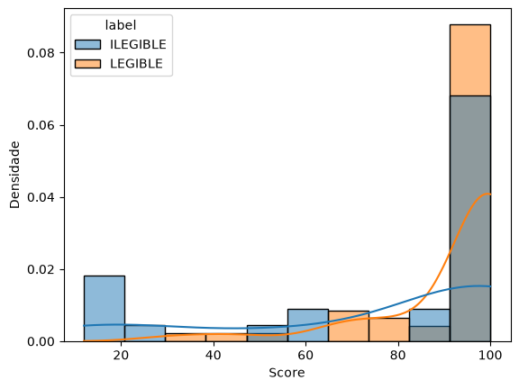
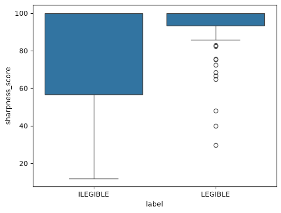
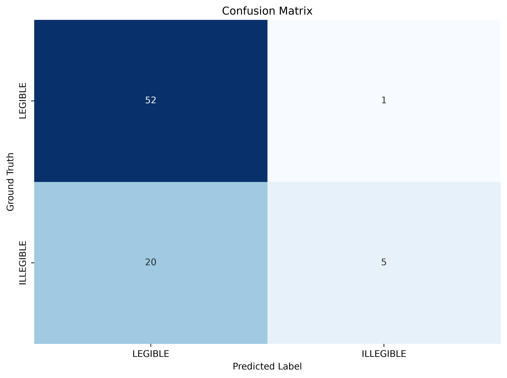
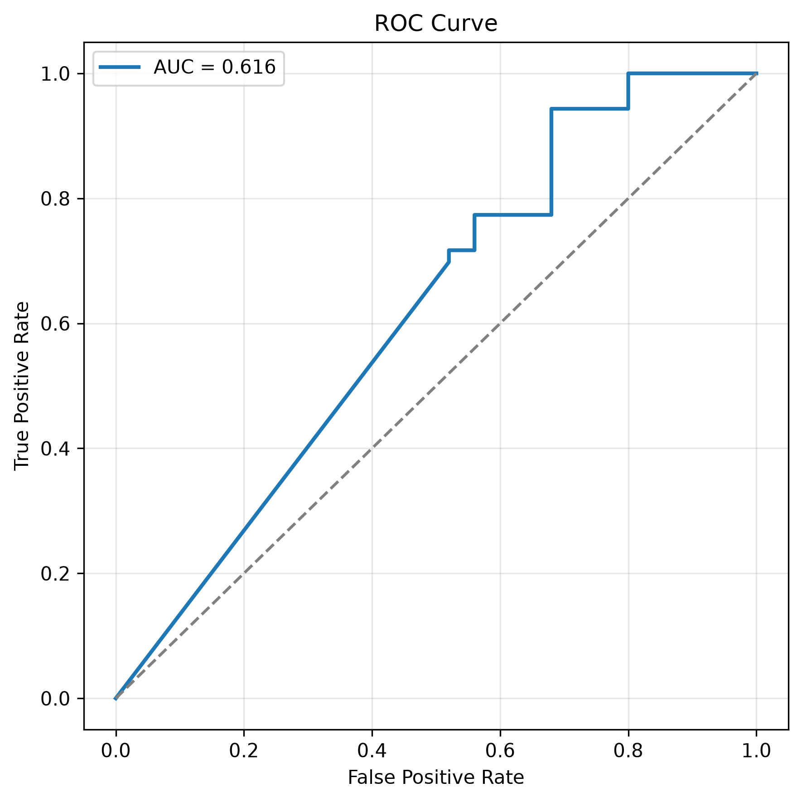

# 1. Contextualização do Problema

Conforme descrito no desafio técnico, o objetivo consiste em desenvolver um componente capaz de classificar automaticamente a legibilidade de documentos, determinando se uma imagem está em condições adequadas para processamento por etapas posteriores do pipeline, como OCR e extração de informações. A especificação define como documento **legível** aquele em que seja possível recuperar pelo menos **80% das informações textuais impressas**, independentemente do tipo de documento utilizado.

Ao longo deste relatório apresento a estratégia adotada para conduzir o desenvolvimento da solução, justificando as decisões de engenharia tomadas durante cada etapa do processo e discutindo os principais *trade-offs* encontrados.

## 1.1 Construção do Dataset

Na minha avaliação, o maior desafio proposto não está na implementação do classificador em si, mas na inexistência de um dataset previamente disponível e rotulado.

Esse aspecto é particularmente relevante porque o problema envolve documentos potencialmente sensíveis, como documentos de identidade, contratos, procurações e comprovantes, cujo compartilhamento é naturalmente limitado por questões de privacidade, sigilo e conformidade regulatória. Além disso, existe uma grande diversidade de documentos que podem aparecer em um ambiente de produção, aumentando significativamente a variabilidade dos dados.

Outro fator importante é que a legibilidade não depende apenas do conteúdo do documento, mas também das condições em que ele foi capturado. Uma mesma imagem pode apresentar diferentes problemas de qualidade, como:

- Desfoque;
- Baixa iluminação;
- Excesso de iluminação;
- Reflexos;
- Cortes;
- Enquadramento inadequado;
- Baixa qualidade da câmera.

Essa combinação entre diversidade de documentos e diversidade de condições de captura torna a construção de um dataset representativo uma das etapas mais importantes do projeto.

## 1.2 Estratégia adotada

Diante desse cenário, decidi iniciar o desenvolvimento pela construção do dataset que seria utilizado ao longo dos experimentos.

Como o desafio não fornecia uma base de dados pronta, optei por utilizar técnicas de **Data Augmentation** para multiplicar artificialmente a quantidade de exemplos disponíveis. A motivação foi reduzir o esforço necessário para produzir um conjunto inicial de dados que permitisse explorar diferentes cenários de degradação de imagens sem depender exclusivamente da coleta manual de documentos reais.

Para este experimento foi utilizado como ponto de partida um documento do tipo **Carteira de Identidade**, armazenado em:

```text
database/
└── input/
```

Naturalmente, esse conjunto não representa a diversidade esperada em um ambiente de produção. Uma solução robusta exigiria, por exemplo:

- Uma quantidade estatisticamente representativa de amostras;
- Diferentes categorias de documentos;
- Documentos capturados por diferentes dispositivos;
- Ampla variedade de condições reais de iluminação, foco e enquadramento;
- Diferentes resoluções e câmeras.

Entretanto, considerando o tempo disponível para execução do desafio, foi necessário priorizar a implementação de todas as etapas previstas no escopo — desde a construção da base até a avaliação dos resultados — em vez de concentrar todo o esforço exclusivamente na coleta e rotulagem dos dados.

Essa decisão reflete uma situação bastante comum em projetos reais de Machine Learning, nos quais é necessário equilibrar profundidade técnica e cobertura funcional dentro de restrições de prazo.

## 1.3 Critérios para escolha da estratégia de Data Augmentation

A estratégia de geração sintética dos dados foi definida considerando três fatores principais.

### Automação

A rotulagem manual de grandes bases de documentos é uma atividade demorada e de alto custo operacional. Sempre que possível, mecanismos automáticos de geração de exemplos permitem acelerar significativamente a construção do dataset e liberar tempo para as etapas de modelagem e avaliação.

### Custo Financeiro

Algumas abordagens de geração sintética dependem de APIs comerciais ou serviços pagos. Embora possam produzir resultados de alta qualidade, seu custo pode tornar inviável a expansão do dataset em larga escala. Assim, o custo operacional também foi considerado como um critério de decisão.

### Qualidade dos Dados

Embora nenhuma técnica sintética substitua completamente um conjunto de documentos reais capturados por usuários em condições reais de uso, a qualidade das imagens geradas é fundamental para que os experimentos reflitam, o máximo possível, os desafios encontrados em produção.

Por esse motivo, diferentes estratégias de **Data Augmentation** foram avaliadas, buscando equilibrar realismo, facilidade de manutenção, custo e escalabilidade.

# 2. Experimentos de Data Augmentation

## 2.1 OpenAI

A primeira abordagem investigada consistiu na utilização da API de geração e edição de imagens da OpenAI para produzir versões degradadas das imagens originais.

A principal vantagem dessa estratégia está na simplicidade de implementação. Novos cenários podem ser criados apenas modificando o texto do *prompt*, sem necessidade de implementar algoritmos específicos para simular cada tipo de degradação.

Durante os experimentos foram avaliados diferentes cenários, entre eles:

- **Darken:** simulação de ambiente com baixa iluminação;
- **Brighten:** simulação de excesso de iluminação;
- **Low Quality Camera:** simulação de captura utilizando uma câmera de baixa qualidade;
- **Glare:** simulação de reflexo intenso sobre o documento;
- **Crop:** simulação de documentos parcialmente cortados.

Essa abordagem apresenta excelente flexibilidade, pois novos cenários podem ser incorporados rapidamente apenas pela definição de novos *prompts*, reduzindo significativamente o esforço de manutenção do código.

Entretanto, dois fatores limitaram sua adoção como solução principal.

O primeiro foi o **custo financeiro**. Cada imagem modificada corresponde a uma chamada paga à API, o que torna a expansão do dataset proporcionalmente mais cara conforme aumenta o número de documentos e de cenários simulados.

O segundo aspecto foi a **qualidade das imagens geradas**. Foram realizados experimentos utilizando inicialmente o modelo **gpt-image-1** e, posteriormente, sua versão mais recente, **gpt-image-2**. Embora ambos tenham produzido imagens visualmente plausíveis, os resultados obtidos ainda apresentaram artefatos e inconsistências que poderiam comprometer a fidelidade necessária para representar degradações reais de documentos.

Por esse motivo, apesar da elevada facilidade de implementação, essa abordagem foi utilizada apenas como etapa exploratória, motivando a investigação de alternativas baseadas em bibliotecas especializadas de processamento de imagens, apresentadas nas seções seguintes.

### Código-fonte

```text
data_augmentation/generate_database_openai.py
```

### Imagens geradas

```text
database/gpt-1/
database/gpt-2/
```

### Custos operacionais

Os custos operacionais mostram que para gerar apenas 13 modificações, foi gasto cerca de \$1.05 (o que custou aproximadamente R$ 5,38). Ou seja, cerca de 41 centavos por imagem, o que se tornaria economicamente inviável para realização desses experimentos.


https://platform.openai.com/settings/organization/usage

## 2.2 FLUX

Após os experimentos iniciais utilizando a API da OpenAI, busquei alternativas que permitissem gerar imagens sintéticas com maior qualidade visual e sem custo recorrente por requisição.

Uma das soluções investigadas foi o **FLUX**, um modelo de geração e edição de imagens de última geração (*state-of-the-art*) que vem apresentando resultados bastante competitivos em tarefas de geração de imagens condicionadas por linguagem natural.

A principal vantagem dessa abordagem seria a possibilidade de executar todo o processo localmente, eliminando os custos associados ao uso de APIs comerciais e permitindo a geração de um volume significativamente maior de imagens para treinamento.

Entretanto, essa alternativa apresenta um requisito computacional elevado. As versões completas do modelo demandam aproximadamente **24 GB de memória de vídeo (VRAM)** para execução local, tornando sua utilização restrita a GPUs de maior capacidade.

Durante os experimentos foram avaliadas algumas estratégias para reduzir esse requisito computacional, principalmente técnicas de **quantização (quantization)**, com o objetivo de diminuir o consumo de memória sem comprometer significativamente a qualidade das imagens geradas.

Apesar dessas tentativas, não foi possível executar o modelo de forma estável no hardware disponível para realização do desafio. Por esse motivo, essa abordagem não pôde ser utilizada nos experimentos apresentados neste relatório.

Ainda assim, considero que o FLUX representa uma alternativa bastante promissora para trabalhos futuros, especialmente em cenários onde exista infraestrutura computacional compatível, permitindo a geração local de grandes volumes de imagens sintéticas com qualidade potencialmente superior às soluções baseadas em APIs utilizadas neste experimento.


## 2.3 Augraphy e Albumentations

Dando continuidade aos experimentos, busquei alternativas de código aberto que pudessem ser executadas localmente e que não apresentassem os requisitos computacionais elevados observados em modelos generativos mais recentes.

Nesse contexto, identifiquei duas bibliotecas amplamente utilizadas pela comunidade de Visão Computacional:

- **Augraphy** — https://github.com/sparkfish/augraphy
- **Albumentations** — https://github.com/albumentations-team/albumentations

Embora ambas sejam bibliotecas de **Data Augmentation**, elas possuem objetivos diferentes e, na prática, se complementam.

### Albumentations

A Albumentations é uma das bibliotecas mais populares para aumento de dados em tarefas de Visão Computacional. Seu foco principal é fornecer transformações genéricas aplicáveis a diferentes problemas de classificação, detecção de objetos e segmentação de imagens.

Entre as transformações disponíveis destacam-se:

- Blur;
- Motion Blur;
- Gaussian Blur;
- Ruídos;
- Compressão JPEG;
- Alterações de brilho e contraste;
- Perspectiva;
- Rotações e transformações afins;
- Sombras;
- Chuva;
- Neve;
- Neblina;
- Entre diversas outras.

Essas transformações são particularmente úteis para simular condições adversas de captura de imagens, aproximando o conjunto de treinamento de cenários encontrados em aplicações reais.

### Augraphy

A Augraphy possui um objetivo mais específico: simular imperfeições presentes em documentos físicos digitalizados ou fotografados.

Enquanto a Albumentations trabalha com transformações genéricas de imagens, a Augraphy concentra-se em reproduzir defeitos típicos de documentos impressos e escaneados, tais como:

- Fotocópias de baixa qualidade;
- Manchas de tinta;
- Sangramento de tinta (*bleed-through*);
- Marcas de grampos;
- Dobras;
- Marcas de encadernação;
- Efeitos de impressão;
- Marcas d'água;
- Ruídos provenientes de scanners;
- Degradações comuns em documentos físicos.

Por esse motivo, as duas bibliotecas acabam sendo complementares. Enquanto a Albumentations simula problemas relacionados ao processo de captura da imagem, a Augraphy reproduz defeitos inerentes ao próprio documento.

### Comparação das abordagens

As duas bibliotecas apresentaram características bastante semelhantes durante os experimentos.

Como pontos positivos, destacam-se:

- Execução 100% local;
- Código aberto;
- Ausência de custo financeiro por imagem gerada;
- Alto desempenho, permitindo gerar grandes quantidades de imagens em poucos minutos;
- Facilidade de integração ao pipeline de geração do dataset.

Por outro lado, ambas apresentam uma limitação importante quando comparadas a modelos de IA generativa.

As transformações disponíveis são implementadas como algoritmos previamente definidos (*pre-sets*), oferecendo pouca flexibilidade para criar novos cenários que não estejam contemplados pela biblioteca. Diferentemente de modelos generativos baseados em *prompts*, como a API da OpenAI, não é possível simplesmente descrever uma nova condição desejada e obter automaticamente uma imagem correspondente.

Apesar dessa limitação, o excelente custo-benefício dessas bibliotecas foi determinante para sua adoção neste projeto. Elas permitiram gerar rapidamente um conjunto diversificado de imagens degradadas, sem custos adicionais e com tempo de processamento reduzido, viabilizando a continuidade dos experimentos dentro do prazo disponível para o desafio técnico.

Os códigos utilizados para geração das imagens encontram-se em:


### Código-fonte

```text
data_augmentation/generate_database_albumentations.py
data_augmentation/generate_database_augraphy.py
```

### Imagens geradas

```text
database/albumentations/
database/augraphy/
```


A tabela a seguir compila a conclusão de todas as análises feitas:

| Critério | OpenAI (GPT-Image) | FLUX | Augraphy | Albumentations |
|----------|---------------------|------|-----------|----------------|
| **Código aberto** | ❌ Não | ✅ Sim | ✅ Sim | ✅ Sim |
| **Execução local** | ❌ Não | ✅ Sim | ✅ Sim | ✅ Sim |
| **Custo financeiro** | 💰 Alto (API paga por imagem) | 🟢 Gratuito | 🟢 Gratuito | 🟢 Gratuito |
| **Custo computacional** | 🟢 Baixo (processamento remoto) | 🔴 Muito alto (~24 GB VRAM) | 🟢 Baixo | 🟢 Baixo |
| **Velocidade de geração** | 🟡 Média (limitada pela API) | 🟡 Média | 🟢 Alta | 🟢 Alta |
| **Escalabilidade** | 🟡 Limitada pelo custo da API | 🟡 Limitada pelo hardware | 🟢 Alta | 🟢 Alta |
| **Qualidade visual** | 🟡 Média | 🟢 Muito alta | 🟢 Alta | 🟡 Boa |
| **Realismo das degradações** | 🟡 Variável | 🟢 Muito alto | 🟢 Alto (documentos) | 🟡 Médio |
| **Personalização** | 🟢 Muito alta (via prompts) | 🟢 Muito alta (via prompts) | 🔴 Baixa (pré-sets) | 🔴 Baixa (pré-sets) |
| **Facilidade de adicionar novos cenários** | 🟢 Muito alta | 🟢 Muito alta | 🟡 Média | 🟡 Média |
| **Adequação para documentos** | 🟡 Boa | 🟢 Muito boa | 🟢 Excelente | 🟢 Boa |
| **Maturidade da solução** | 🟢 Alta | 🟡 Em evolução | 🟢 Alta | 🟢 Muito alta |
| **Decisão neste projeto** | Avaliada, mas descartada devido ao custo e à qualidade obtida | Avaliada, mas inviável devido aos requisitos computacionais | **Utilizada** | **Utilizada** |

## 2.4 Rotulagem do Dataset

Após a geração das imagens utilizando as bibliotecas **Albumentations** e **Augraphy**, a etapa seguinte envolveu a rotulagem manual dos dados.

Cada imagem gerada foi inspecionada visualmente e classificada em uma das duas categorias propostas pelo desafio:

- **Legível**;
- **Ilegível**.

Embora essa etapa seja relativamente simples do ponto de vista técnico, ela representa uma das atividades mais demoradas na construção de um dataset supervisionado, pois exige a inspeção individual de todas as imagens geradas.

Ao final desse processo, obtive a seguinte distribuição:

| Classe | Quantidade | Percentual |
|---------|-----------:|-----------:|
| Legível | 53 | 68% |
| Ilegível | 25 | 32% |
| **Total** | **78** | **100%** |

Portanto, o conjunto de dados apresenta um **desbalanceamento entre as classes**, com predominância de documentos classificados como legíveis.

Embora esse nível de desbalanceamento não seja extremo, ele pode influenciar o treinamento de alguns algoritmos de classificação, fazendo com que o modelo aprenda a favorecer a classe majoritária caso nenhuma estratégia seja adotada.

Existem diversas abordagens para lidar com esse problema durante a etapa de modelagem, dentre elas:

1. **Balanceamento do conjunto de dados**, utilizando técnicas como *undersampling* da classe majoritária ou *oversampling* da classe minoritária (por exemplo, RandomOverSampler ou SMOTE);

2. **Modelos que permitam ponderação das classes**, utilizando parâmetros como `class_weight='balanced'`, reduzindo o impacto do desbalanceamento durante o treinamento;

3. **Utilização de métricas apropriadas para dados desbalanceados**, evitando avaliar o modelo apenas pela acurácia. Nesse contexto, métricas como **Precision**, **Recall**, **F1-score**, **ROC-AUC** e **Precision-Recall Curve (PR Curve)** fornecem uma visão mais representativa do desempenho do classificador.

Neste trabalho, a identificação desse desbalanceamento foi considerada durante a etapa de modelagem e na escolha das métricas utilizadas para avaliação dos experimentos.

As imagens rotuladas encontram-se organizadas na seguinte estrutura:

```text
database/
└── labels/
    ├── legible/
    └── illegible/
```

# 3. Baseline

Antes da construção de modelos mais sofisticados, implementei um **baseline** cujo objetivo foi verificar se métricas clássicas de processamento digital de imagens seriam suficientes para distinguir documentos legíveis de documentos ilegíveis.

O código-fonte encontra-se disponível em:

```text
classifier/baseline_quality_estimator.py
```

A hipótese investigada foi a seguinte:

> Documentos legíveis tendem a apresentar bordas bem definidas e transições abruptas de intensidade entre caracteres e fundo. Em contrapartida, documentos desfocados apresentam suavização dessas transições, reduzindo significativamente a quantidade de informação de alta frequência presente na imagem.

Com base nessa hipótese, utilizei duas métricas clássicas de Visão Computacional:

- Variância do Laplaciano;
- Intensidade média do gradiente de Sobel.

Essas métricas são amplamente utilizadas na literatura para estimativa de nitidez (*image sharpness estimation*) e detecção de borramento (*blur detection*).

---

## 3.1 Operador Laplaciano

O operador Laplaciano é baseado na **segunda derivada espacial** da imagem.

Considere uma imagem em escala de cinza representada por:

\[
I(x,y)
\]

O Laplaciano é definido como:

\[
\nabla^2 I =
\frac{\partial^2 I}{\partial x^2}
+
\frac{\partial^2 I}{\partial y^2}
\]

Na prática, essa operação é implementada através da convolução da imagem com uma máscara discreta, por exemplo:

\[
\begin{bmatrix}
0 & 1 & 0\\
1 & -4 & 1\\
0 & 1 & 0
\end{bmatrix}
\]

ou

\[
\begin{bmatrix}
1 & 1 & 1\\
1 & -8 & 1\\
1 & 1 & 1
\end{bmatrix}
\]

Após aplicar esse operador, regiões com mudanças bruscas de intensidade produzem valores elevados, enquanto regiões suavizadas apresentam resposta próxima de zero.

Entretanto, utilizar apenas o Laplaciano não é suficiente. Por esse motivo, calcula-se sua **variância**:

\[
\sigma_L^2
=
\frac{1}{N}
\sum_{i=1}^{N}
(L_i-\mu_L)^2
\]

onde:

- \(L_i\) representa cada pixel da imagem Laplaciana;
- \(\mu_L\) é a média dos valores do Laplaciano;
- \(N\) é o número de pixels.

Quanto maior essa variância, maior tende a ser a quantidade de bordas presentes na imagem e, consequentemente, maior sua nitidez.

No código, essa métrica corresponde a:

```python
laplacian = cv2.Laplacian(image, cv2.CV_64F)
lap_var = laplacian.var()
```

---

## 3.2 Operador de Sobel

Enquanto o Laplaciano utiliza a segunda derivada, o operador de Sobel estima a **primeira derivada** da imagem.

Primeiramente são calculados os gradientes nas direções horizontal e vertical:

\[
G_x=
\frac{\partial I}{\partial x}
\]

\[
G_y=
\frac{\partial I}{\partial y}
\]

Esses gradientes são obtidos pela convolução da imagem utilizando os kernels:

### Gradiente horizontal

\[
\begin{bmatrix}
-1&0&1\\
-2&0&2\\
-1&0&1
\end{bmatrix}
\]

### Gradiente vertical

\[
\begin{bmatrix}
-1&-2&-1\\
0&0&0\\
1&2&1
\end{bmatrix}
\]

Em seguida calcula-se a magnitude do gradiente:

\[
G=
\sqrt{G_x^2+G_y^2}
\]

Quanto maior o gradiente, maior a intensidade das bordas presentes na imagem.

Neste trabalho foi utilizada a **média da magnitude dos gradientes**:

\[
\bar G
=
\frac1N
\sum_{i=1}^{N}
G_i
\]

No código:

```python
gx = cv2.Sobel(image, cv2.CV_64F, 1, 0)
gy = cv2.Sobel(image, cv2.CV_64F, 0, 1)

gradient = np.sqrt(gx**2 + gy**2)
grad_mean = gradient.mean()
```

---

## 3.3 Combinação das métricas

As duas métricas capturam propriedades complementares da imagem.

O **Laplaciano** mede a quantidade de detalhes de alta frequência presentes na imagem, enquanto o **Sobel** mede a intensidade média das bordas.

Após diversos experimentos, ambas foram normalizadas para o intervalo \([0,1]\):

\[
S_L
=
\min
\left(
\frac{\sigma_L^2}{600},
1
\right)
\]

\[
S_G
=
\min
\left(
\frac{\bar G}{50},
1
\right)
\]

O score final foi calculado por uma combinação linear:

\[
Score
=
100
\left(
0.7S_L
+
0.3S_G
\right)
\]

A atribuição de maior peso ao Laplaciano foi definida empiricamente durante os experimentos, pois essa métrica apresentou maior sensibilidade às variações de nitidez observadas nas imagens do conjunto de dados.

O resultado final é um valor compreendido entre **0 e 100**, onde valores próximos de **100** indicam documentos potencialmente legíveis, enquanto valores próximos de **0** indicam documentos com maior probabilidade de estarem desfocados ou ilegíveis.

---

## 3.4 Limitações da abordagem

Embora essa abordagem seja extremamente simples e computacionalmente eficiente, ela possui algumas limitações importantes.

A principal delas é assumir que a qualidade de um documento depende exclusivamente da nitidez de suas bordas.

Na prática, documentos podem ser considerados ilegíveis mesmo apresentando elevada nitidez, por exemplo:

- excesso de iluminação;
- reflexos;
- cortes;
- baixa resolução;
- oclusões;
- sombras intensas;
- perda parcial do documento.

Da mesma forma, documentos ligeiramente desfocados ainda podem permanecer perfeitamente legíveis para um mecanismo de OCR.

Essas limitações motivam a investigação de modelos mais sofisticados, capazes de aprender automaticamente diferentes tipos de degradação presentes nas imagens.

# 4. Construção do Ground Truth

O desafio estabelece que uma imagem somente deve ser considerada **legível** quando seja possível recuperar pelo menos **80% das informações textuais** presentes no documento.

Para permitir essa avaliação de forma objetiva, foi necessário construir manualmente um **Ground Truth** contendo todas as informações textuais esperadas para o documento utilizado como referência.

O arquivo foi armazenado em:

```text
database/labels/rg_real.json
```

A decisão de utilizar apenas uma imagem como referência para esta etapa foi motivada pelo tempo disponível para execução do desafio. Para cada novo documento seria necessário construir manualmente um novo arquivo de Ground Truth, descrevendo todos os campos presentes na imagem.

Esse processo é bastante trabalhoso e cresce linearmente com a quantidade de documentos utilizados nos experimentos. Assim, considerando o prazo do desafio, optei por validar toda a metodologia utilizando um único documento, permitindo concentrar esforços na implementação completa do pipeline de avaliação.

Naturalmente, em um cenário de produção, seria desejável construir Ground Truths para um conjunto significativamente maior de documentos, contemplando diferentes tipos documentais e diferentes cenários de captura.

O Ground Truth utilizado neste experimento encontra-se representado pelo seguinte JSON:

```json
{
  "document": {
    "type": "identity_card",
    "country": "BR",
    "issuer": {
      "country": "República Federativa do Brasil",
      "government": "Governo Federal",
      "state": "Distrito Federal",
      "agency": "Secretaria de Segurança do Distrito Federal"
    },
    "title": "Carteira de Identidade"
  },
  "fields": {
    "name": {
      "label": "Nome / Name",
      "value": "Maria Joana Ribeiro"
    },
    "social_name": {
      "label": "Nome Social / Social Name",
      "value": null
    },
    "personal_number": {
      "label": "Registro Geral - CPF / Personal Number",
      "value": "088.794.450-73"
    },
    "sex": {
      "label": "Sexo / Sex",
      "value": "F"
    },
    "birth_date": {
      "label": "Data de Nascimento / Date of Birth",
      "value": "01/01/1971"
    },
    "nationality": {
      "label": "Nacionalidade / Nationality",
      "value": "BRASILEIRA"
    },
    "place_of_birth": {
      "label": "Naturalidade / Place of Birth",
      "value": "Brasília"
    },
    "expiry_date": {
      "label": "Data de Validade / Date of Expiry",
      "value": "31/12/2024"
    },
    "signature": {
      "label": "Assinatura do Titular / Cardholder's Signature",
      "present": true
    }
  }
}
```

Esse arquivo serviu como referência para comparar automaticamente as informações extraídas pelo mecanismo de OCR, permitindo calcular o percentual de campos corretamente recuperados e verificar se o documento atende ao critério de **80% de recuperação textual** estabelecido no desafio.

# 5. Extração das Informações Textuais

Conforme descrito anteriormente, o desafio estabelece que um documento somente deve ser considerado **legível** quando seja possível recuperar pelo menos **80% das informações textuais** nele contidas.

Para automatizar essa etapa de validação, foi desenvolvido um módulo denominado `ocr`, responsável por realizar a extração estruturada das informações presentes nas imagens.

A implementação encontra-se organizada nos seguintes arquivos:

```text
ocr/
├── prompt.py
├── run_qwen.py
└── service.py
```

Cada arquivo possui uma responsabilidade específica:

- **prompt.py:** contém o prompt utilizado para instruir o modelo de linguagem durante a tarefa de OCR;
- **run_qwen.py:** realiza a comunicação com o modelo Qwen 2.5-VL e executa o processo de inferência;
- **service.py:** encapsula a lógica de extração, padronizando a interface utilizada pelo restante da aplicação.

## 5.1 Escolha do modelo

Após uma pesquisa comparando diferentes modelos multimodais executáveis localmente, o **Qwen 2.5-VL 7B** foi escolhido por apresentar um bom equilíbrio entre quatro critérios considerados relevantes para este desafio:

- qualidade da extração textual (OCR);
- velocidade de inferência;
- consumo de memória (VRAM);
- capacidade de compreender documentos estruturados.

Embora existam modelos maiores e potencialmente mais precisos, o objetivo deste trabalho foi demonstrar uma solução que pudesse ser executada localmente utilizando hardware acessível, sem comprometer significativamente a qualidade dos resultados.

## 5.2 Engenharia de Prompt

Modelos multimodais são altamente sensíveis às instruções fornecidas durante a inferência. Dessa forma, foi elaborado um prompt com o objetivo de reduzir ambiguidades e garantir que a saída produzida fosse consistente entre diferentes imagens.

O prompt utilizado segue a seguinte estrutura:

```text
You are an OCR engine.

Read every visible character from the document.

Rules:

- Do not summarize.
- Do not correct spelling.
- Do not infer missing text.
- Preserve line breaks.
- Preserve punctuation.
- Ignore the background.

Return ONLY valid JSON.

JSON structured example.
```

Cada regra foi definida para minimizar comportamentos indesejados dos Modelos de Linguagem (LLMs), como:

- corrigir automaticamente erros presentes na imagem;
- completar informações parcialmente ocultas;
- resumir o conteúdo do documento;
- alterar pontuação ou formatação.

Essas restrições tornam a saída do modelo mais próxima de um mecanismo tradicional de OCR, preservando fielmente as informações observadas na imagem.

## 5.3 Saída estruturada

Diferentemente de mecanismos tradicionais de OCR, que normalmente retornam apenas texto bruto, o modelo foi instruído a produzir diretamente uma estrutura em **JSON**.

A estrutura gerada replica exatamente o formato definido durante a construção do *Ground Truth*, disponível em:

```text
database/labels/rg_real.json
```

Essa padronização permitiu comparar automaticamente os valores extraídos com os valores esperados, simplificando a etapa de validação e possibilitando o cálculo do percentual de informações corretamente recuperadas.

Como ambos os arquivos seguem a mesma estrutura hierárquica, a comparação pode ser realizada campo a campo, permitindo identificar não apenas se o documento atingiu o requisito mínimo de **80% de recuperação textual**, mas também quais informações foram corretamente reconhecidas e quais apresentaram divergências.

# 6. Avaliação da Solução

Após a implementação do pipeline de classificação e do mecanismo de OCR, foi desenvolvido um módulo responsável pela avaliação experimental da solução.

Esse módulo encontra-se organizado da seguinte forma:

```text
evaluation/
├── baseline_evaluator.ipynb
├── ocr_evaluator.py
└── ocr_run_tests.py
```

Cada arquivo possui uma finalidade específica dentro do processo de validação.

## 6.1 Avaliação do Baseline

O notebook `baseline_evaluator.ipynb` foi utilizado para executar os experimentos descritos na **Seção 3 - Baseline**.

Nele são avaliados os scores produzidos pela combinação da **Variância do Laplaciano** e da **Magnitude Média do Gradiente de Sobel**, permitindo verificar se essas métricas são capazes de distinguir documentos legíveis de documentos ilegíveis.

Além disso, o notebook facilita a inspeção visual dos resultados e o ajuste dos parâmetros utilizados durante os experimentos.

---

## 6.2 Avaliação do OCR

O script `ocr_evaluator.py` é responsável por comparar automaticamente o JSON produzido pelo modelo **Qwen 2.5-VL** com o Ground Truth construído manualmente (`database/labels/rg_real.json`).

Como ambos utilizam exatamente a mesma estrutura hierárquica, a comparação pode ser realizada campo a campo, identificando quais informações foram corretamente extraídas e quais apresentaram divergências.

Essa abordagem elimina a necessidade de inspeção manual dos resultados e torna o processo de avaliação completamente reproduzível.

---

## 6.3 Métrica de Avaliação

O desafio estabelece que um documento somente pode ser considerado **legível** quando for possível recuperar pelo menos **80% das informações textuais** presentes na imagem.

Para verificar esse requisito de forma objetiva, foi desenvolvida uma métrica baseada na **Acurácia por Campo (*Field-level Accuracy*)**.

Como o JSON produzido pelo modelo de OCR possui exatamente a mesma estrutura do arquivo de referência (*Ground Truth*), a comparação pode ser realizada campo a campo.

Cada atributo do JSON é comparado com seu respectivo valor esperado. Antes da comparação, ambos os valores passam por uma etapa de normalização, na qual:

- espaços em branco excedentes são removidos;
- todos os caracteres são convertidos para letras minúsculas (*lowercase*).

Essa normalização evita que diferenças de capitalização ou pequenos espaços em branco sejam contabilizados como erro, mantendo a comparação sensível apenas ao conteúdo textual.

Cada campo recebe uma pontuação binária definida por:

\[
s_i=
\begin{cases}
100, & \text{se o valor previsto é idêntico ao Ground Truth};\\
0, & \text{caso contrário.}
\end{cases}
\]

Sejam:

- \(N\): número total de campos avaliados;
- \(s_i\): pontuação atribuída ao campo \(i\).

A pontuação global do OCR é calculada pela média aritmética dos scores individuais:

\[
Score=
\frac{1}{N}
\sum_{i=1}^{N}
s_i
\]

Como cada campo possui o mesmo peso, essa expressão pode ser simplificada para:

\[
Score=
100\times
\frac{\text{Número de campos corretamente reconhecidos}}
{\text{Número total de campos}}
\]

Por exemplo, considerando um documento contendo **10 campos**, caso o modelo reconheça corretamente **8** deles, a pontuação obtida será:

\[
Score=
100\times
\frac{8}{10}
=
80\%
\]

Esse resultado indica que o documento atende ao requisito mínimo estabelecido pelo desafio.

Essa abordagem apresenta algumas vantagens para o problema proposto:

- possui implementação simples e totalmente reproduzível;
- é facilmente interpretável;
- avalia diretamente o percentual de informações corretamente recuperadas pelo OCR;
- está alinhada ao requisito funcional do desafio, que exige a recuperação de pelo menos **80% das informações textuais** do documento.

Embora existam métricas clássicas para avaliação de OCR, como **Character Error Rate (CER)** e **Word Error Rate (WER)**, elas são mais indicadas para comparar sequências de texto contínuas. Neste trabalho, como a saída do modelo é um **JSON estruturado**, contendo campos semânticos bem definidos, a **Acurácia por Campo** mostrou-se uma métrica mais adequada e de interpretação mais direta para avaliar o desempenho da solução.

---

# 7. Resultados Experimentais

Os resultados obtidos pelo baseline encontram-se disponíveis no notebook:

```text
evaluation/baseline_evaluator.ipynb
```

A Figura X apresenta o histograma da distribuição dos *scores* produzidos pelo estimador de nitidez baseado na combinação dos operadores de **Laplace** e **Sobel**, separados pelas classes **LEGIBLE** e **ILLEGIBLE**.



Observa-se que as duas classes apresentam uma região significativa de sobreposição. Embora documentos classificados como **LEGIBLE** tendam a concentrar-se em valores mais elevados de nitidez, diversas imagens classificadas como **ILLEGIBLE** também apresentam *scores* elevados. Isso indica que a nitidez, isoladamente, não constitui uma característica suficientemente discriminativa para separar corretamente as duas classes.

Essa limitação torna-se ainda mais evidente quando analisamos o boxplot apresentado na Figura X.



Percebe-se que a classe **LEGIBLE** apresenta uma distribuição mais concentrada em altos valores de nitidez, enquanto a classe **ILLEGIBLE** apresenta maior dispersão. Entretanto, existe uma ampla região de interseção entre as distribuições, evidenciando que documentos ilegíveis podem apresentar bordas relativamente bem definidas e que outros fatores, como reflexos, sombras, cortes, baixa resolução e oclusões, também influenciam significativamente a legibilidade.

Em função do tempo disponível para execução deste desafio, optei por priorizar a implementação completa da metodologia proposta, não sendo possível aprofundar a análise estatística do conjunto de dados ou investigar modelos alternativos potencialmente mais robustos para o problema.

Durante os experimentos, foi realizada a busca pelo limiar (*threshold*) que maximizasse o desempenho do classificador. O melhor resultado foi obtido utilizando um **threshold igual a 29,79**, alcançando um **F1-score de 0,84**.

A Figura X apresenta a matriz de confusão correspondente a esse limiar.



Observa-se que o modelo classificou corretamente **52 dos 53** documentos legíveis, porém identificou corretamente apenas **5 dos 25** documentos ilegíveis. Em contrapartida, **20 documentos ilegíveis** foram incorretamente classificados como legíveis.

Esse comportamento evidencia um viés do classificador em favorecer a classe majoritária (**LEGIBLE**), característica frequentemente observada em conjuntos de dados desbalanceados quando não são empregadas estratégias específicas de balanceamento ou algoritmos mais robustos para esse cenário.

Por fim, a Figura X apresenta a Curva ROC obtida pelo modelo.



A área sob a curva (**AUC = 0,616**) indica que o baseline possui capacidade discriminativa limitada, apresentando desempenho apenas moderadamente superior ao de um classificador aleatório (AUC = 0,5).

Esse resultado é consistente com as análises anteriores. Embora os operadores de Laplace e Sobel sejam capazes de capturar informações relacionadas à nitidez da imagem, eles não conseguem representar outros fatores que impactam diretamente a legibilidade de documentos. Consequentemente, a utilização exclusiva dessas métricas mostrou-se insuficiente para resolver o problema de forma robusta.

Ainda assim, o objetivo desta etapa foi atingido. O baseline estabeleceu uma referência inicial de desempenho e demonstrou, de forma quantitativa, as limitações de uma abordagem baseada apenas em operadores clássicos de processamento de imagens, justificando a investigação futura de modelos baseados em aprendizado profundo ou modelos multimodais.

| Métrica | Valor |
|---------|------:|
| Threshold ótimo | **29,79** |
| AUC (ROC) | **0,616** |
| F1-score | **0,84** |
| Precisão (Precision) | **0,722** |
| Revocação (Recall / Sensitivity) | **0,981** |
| Especificidade (Specificity) | **0,200** |
| Verdadeiros Positivos (TP) | **52** |
| Verdadeiros Negativos (TN) | **5** |
| Falsos Positivos (FP) | **20** |
| Falsos Negativos (FN) | **1** |

---

# 8. Conclusão

Este trabalho apresentou uma solução completa para o desafio de classificação de legibilidade de documentos, contemplando todas as etapas do processo, desde a construção do conjunto de dados até a avaliação quantitativa dos resultados obtidos.

Na ausência de um dataset previamente rotulado, foi necessário desenvolver uma estratégia própria para geração de dados sintéticos utilizando as bibliotecas **Albumentations** e **Augraphy**, seguida da rotulagem manual das imagens produzidas. Essa abordagem permitiu construir rapidamente um conjunto de dados representativo para validação da metodologia proposta.

Como etapa inicial de modelagem, foi desenvolvido um baseline baseado em operadores clássicos de Processamento Digital de Imagens, utilizando a Variância do Laplaciano e a Magnitude do Gradiente de Sobel como estimadores de nitidez. Os experimentos demonstraram que, embora essas métricas capturem parte das características relacionadas à qualidade visual dos documentos, elas apresentam capacidade limitada para discriminar corretamente documentos legíveis e ilegíveis, evidenciada pela sobreposição entre as distribuições dos scores e pelo valor de **AUC = 0,616**.

Além da classificação, foi implementado um pipeline de OCR baseado no modelo multimodal **Qwen 2.5-VL 7B**, aliado a uma estratégia de *Prompt Engineering* capaz de produzir saídas estruturadas em JSON. Essa decisão simplificou significativamente a etapa de avaliação, permitindo comparar automaticamente os resultados do OCR com um *Ground Truth* construído manualmente e verificar objetivamente o requisito do desafio de recuperar pelo menos **80% das informações textuais** do documento.

Embora diversas simplificações tenham sido adotadas em função do tempo disponível para execução do desafio, a solução desenvolvida demonstra a viabilidade da abordagem proposta e estabelece uma base sólida para futuras evoluções. Entre os próximos passos, destacam-se a expansão do conjunto de dados, a utilização de modelos supervisionados baseados em aprendizado profundo e a investigação de arquiteturas multimodais capazes de compreender simultaneamente aspectos visuais e semânticos dos documentos.

---


<p align="center">
  
</p>

<p align="center">
  <strong>Ítalo de Pontes Oliveira</strong><br>
  Data Scientist | M.Sc. Computer Science<br>
  italo.cientista@gmail.com<br>
  +55 (11) 97081-8159
</p>